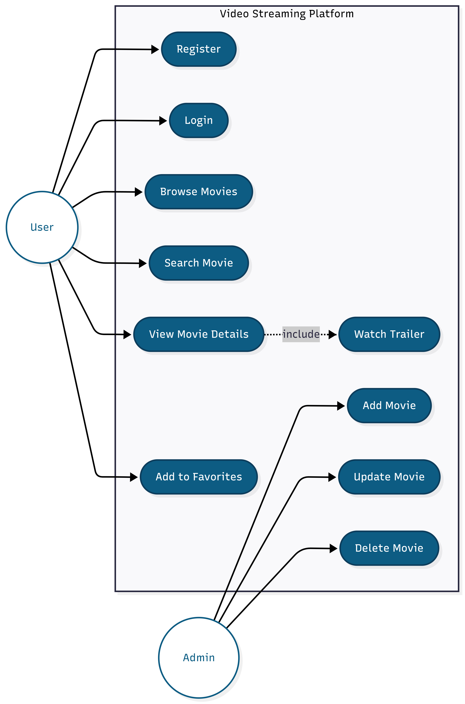
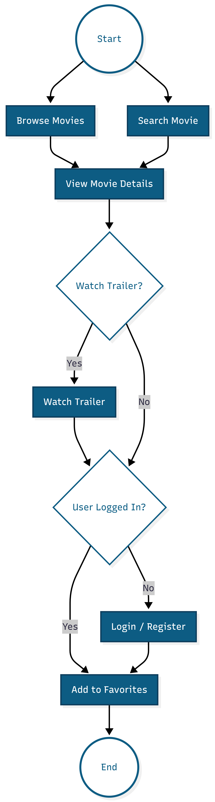
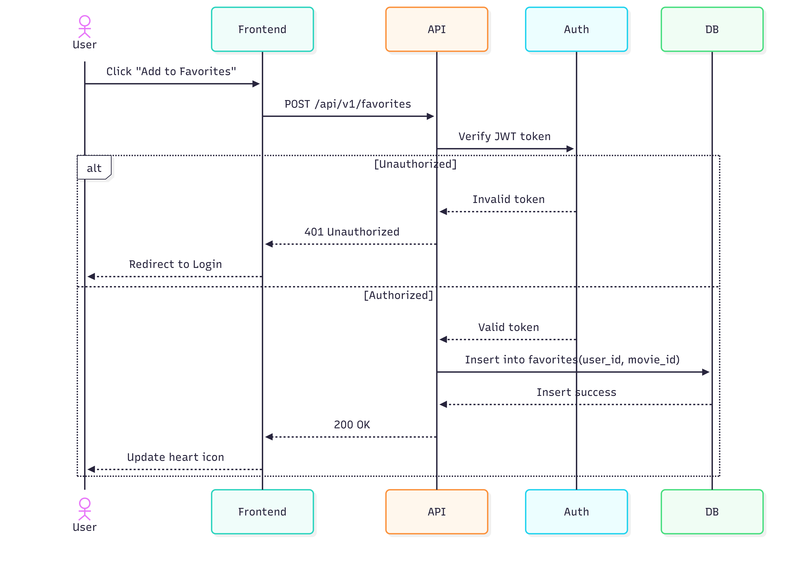
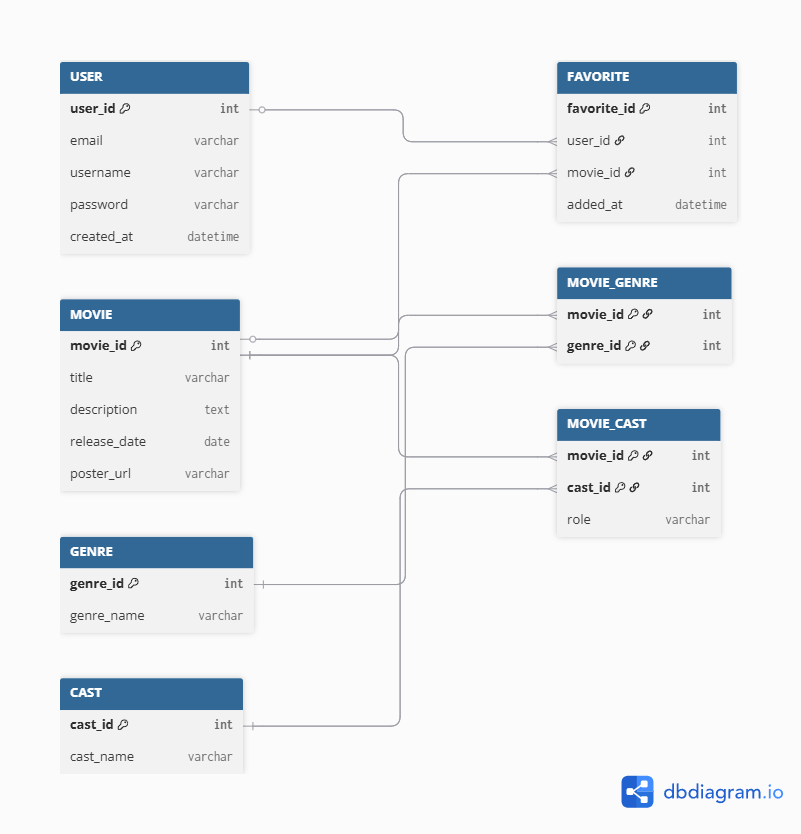
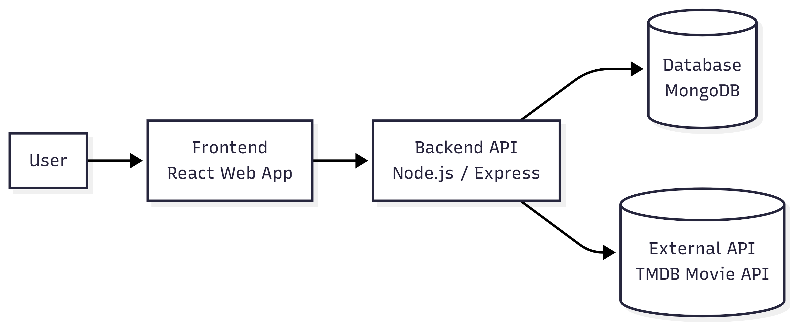

# Video Streaming Platform – Business Analysis Case Study

## Overview
This project demonstrates the business analysis process for designing a video streaming platform.

## Key Artifacts
- Use Case Diagram
- Activity Diagram
- Sequence Diagram
- Entity Relationship Diagram
- System Architecture Diagram

## Features
- Movie browsing
- Search functionality
- Movie detail view
- Favorites management

## Diagrams

### Use Case

### Activity Diagram

### Sequence Diagram

### ERD

### System Architecture

## Author
Nhu Thanh Hoang To
